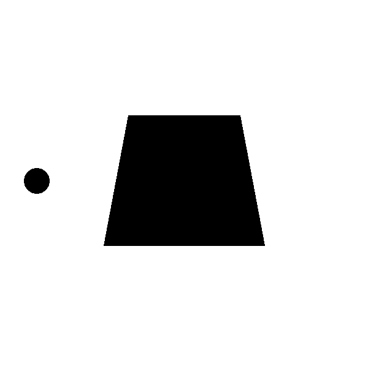
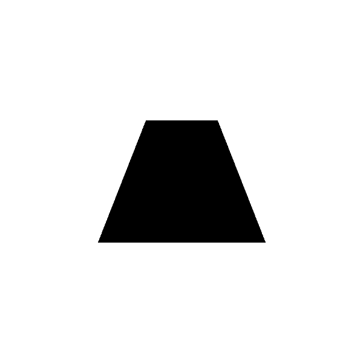
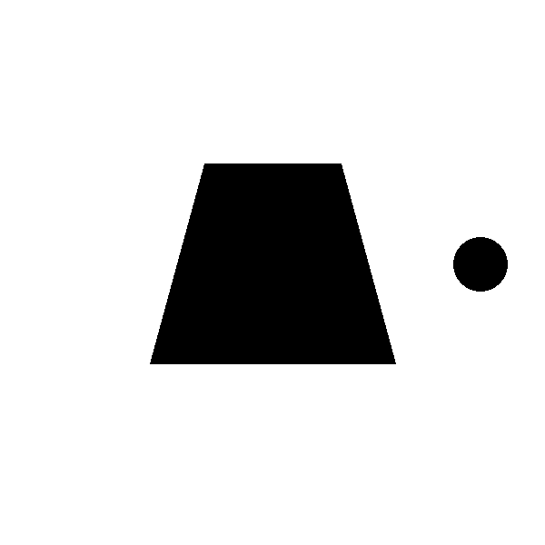
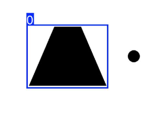
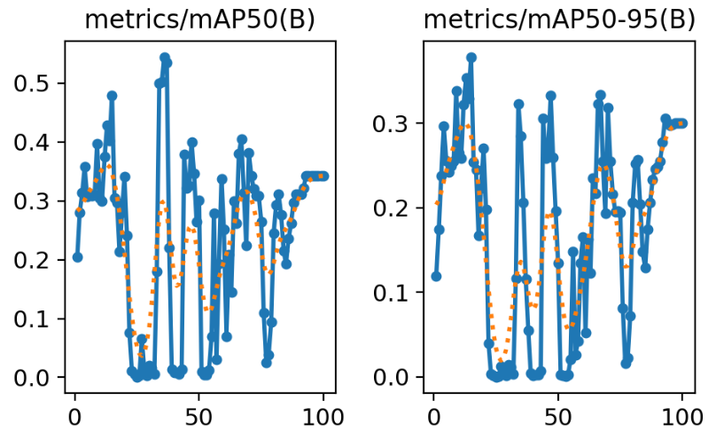
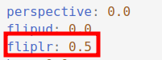
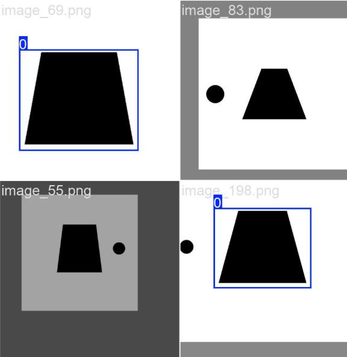
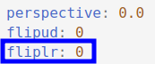
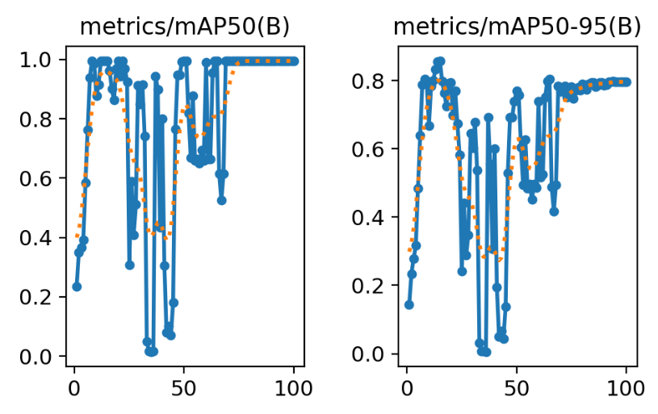

# Spatial_Dependency_Probe
A machine learning project that tests if object detection models can recognize objects based on their relative spatial positions.

## Introduction

Have you ever wondered whether a visual model recognizes an object purely based on the object itself, or if it also uses contextual information from its surroundings?  

In human perception, recognizing an object often depends not only on its appearance but also on its spatial relationship with other objects.  
For example, a nose is typically located below the eyes, car wheels are below the car body, and a monitor usually sits on top of a desk.  

In this experimental project, I aim to test whether **YOLO**, one of today’s most popular object detection models, possesses the ability to use **contextual or relative positional information** between objects during detection.

---

## Theoretical Hypothesis

**My hypothesis: yes.**

YOLO is built upon convolutional neural networks (CNNs), and one of the most important properties of CNNs is the **receptive field**.  
As the network goes deeper, each feature in the later layers is influenced by a large portion of the original image — sometimes nearly the whole image.  

In addition, YOLO integrates **multi-scale feature fusion** through its feature pyramid architecture.  
Together, these design choices suggest that YOLO should, at least theoretically, have the capacity to leverage spatial and contextual cues across the entire image for detection.

---

## Experiment

For this study, I used **YOLOv11** to perform the experiment.  
YOLO is now an open-source product developed by **Ultralytics**, released under the **AGPL-3.0** license.  
Therefore, this project also follows the same AGPL-3.0 license terms.  

Another reason I chose YOLO is its excellent usability — once installed, it can be trained almost immediately, which helps keep the experimental process efficient.

---

### Experiment Definition

We define the task as detecting a **trapezoid** in an image, but **only if there is a small circle on its right side**.  
If the circle is on the left side (or absent), then the trapezoid **should not** be detected as the target object.  

In other words, the detection condition depends on the **relative spatial relationship** — “the trapezoid must have a circle to its right.”

---

### Data Preparation

I generated the synthetic dataset using a simple image-generation script (see `images_gen.py`).

[Negative sample]  

[Negative sample]  

[Positive sample]  

---

### Annotation

This step is straightforward — I used standard open-source annotation tools such as **LabelImg** and **CVAT**.

---

### Training (default settings)

After training for 100 epochs, you might feel disappointed:  
YOLOv11 seems **unable to recognize objects that depend on relative position** — it only identifies objects based on their intrinsic features.  

Let’s analyze why this apparent “training collapse” might occur.

YOLO includes **data augmentation** by default to improve robustness.  
However, one of these augmentations is **horizontal flipping**.  
Let’s take a closer look at the data augmentation configuration used in the first experiment:

[Augmentation parameters]

It performs the following:
1. **Horizontal flipping** – images are mirrored, causing right-circle trapezoids to appear as left-circle trapezoids;  
2. **Cropping** – parts of the circle may be removed entirely, leaving trapezoids without circles.  

This conflicts directly with our experimental definition.  
As a result, the training data becomes contradictory — the same kind of sample might appear both as positive and negative examples, leading to **training instability**.  
(Garbage in, garbage out.)

---

### Training (with some augmentations disabled)

Next, I disabled horizontal flipping and retrained the model.

[Data augmentation settings after disabling flipping]

This time, the training result is much more promising!  
Once the conflicting augmentations were removed, the data became consistent, and the model converged much better.  

If we were to further disable other augmentations such as cropping or mosaic combinations, I expect the model would converge even faster.  
I’ll leave that for future exploration — interested readers are welcome to dive deeper.

---

## Conclusion

The results support my initial hypothesis.  
Because YOLO’s architecture is based on CNNs with large receptive fields and multi-scale feature fusion, it **can indeed utilize contextual and spatial information** to perform object detection.

---

## Future Work

This experiment can be extended to other models such as **VGG**, **ResNet**, earlier YOLO versions that use **anchor-based mechanisms**, and the latest **Transformer-based models** like **ViT** and **DETR**.  

## License
This project is licensed under the AGPL-3.0 License — same as the original Ultralytics YOLO.

